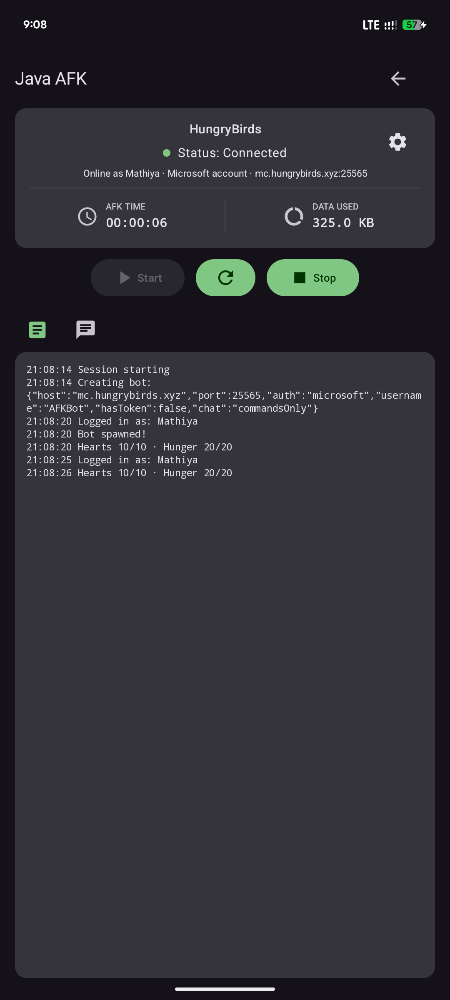
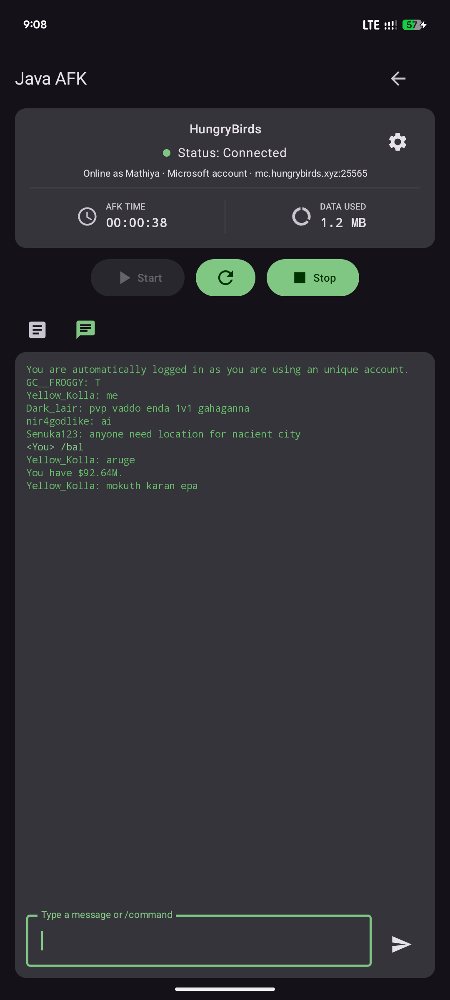
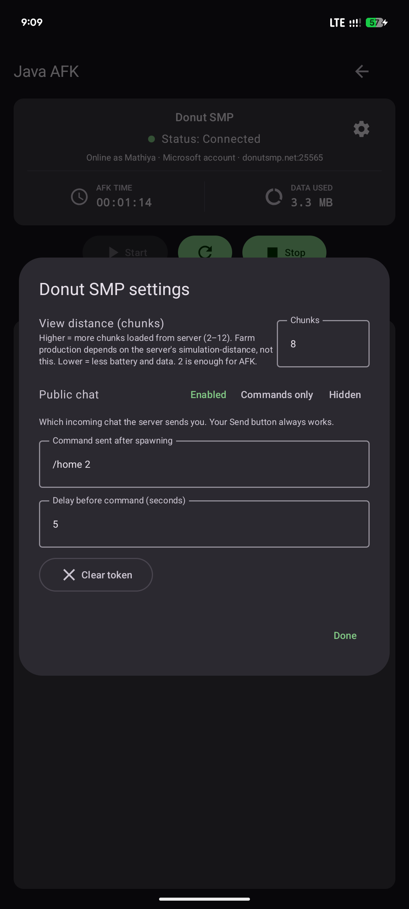
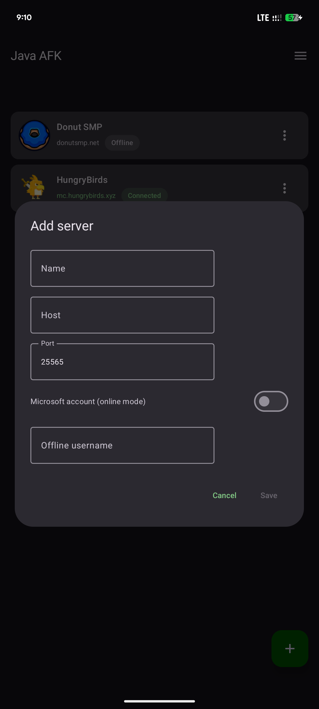

# Java AFK v2.5

Android app that keeps your Minecraft **Java Edition** account online (AFK) on any
server — backed by [mineflayer](https://github.com/PrismarineJS/mineflayer)
running on an embedded Node.js runtime, plus a Go
[gophertunnel](https://github.com/Sandertv/gophertunnel)-based Bedrock engine
for headless/CLI use.

## What's new in v2.5

- **Loop a message** — new per-server setting (⚙) that repeats a chat message
  or `/command` on its own delay while connected. Restarts cleanly after every
  reconnect, never doubles up. Separate from the existing **Run once after
  spawn** command, which still fires once per login.
- **Hidden chat actually hides** — `Hidden` now also filters plugin-formatted
  public chat (Essentials/LuckPerms-style `<name>` lines, join/leave,
  advancements) that servers send as system messages. Replies to your own
  commands still show.
- **No more phantom kick notice** — the "Kicked or disconnected" banner now
  fires exactly once per real drop, never replays when reopening a panel.
- **Chat crash fixed** — duplicate message delivery could crash the chat tab;
  delivery is now de-duplicated.
- **Quieter Logs tab** — hearts/hunger lines only appear when the values
  actually change (no more 30 s drip while AFK for hours).
- **Instant panel opens** — reopening a server no longer flashes
  "Select a server from the list first."

## How it works

- The app itself is the UI + session state (one `ServerSession` per server).
  It never embeds the bot — all Minecraft traffic goes through a single
  embedded Node.js process.
- That Node process hosts a tiny local HTTP bridge (`127.0.0.1:3001`) and one
  mineflayer bot per running server (max 5). The app sends `start` / `stop` /
  `chat` / `config` commands; the bridge streams back status, logs and chat,
  which the app polls and displays.
- Drops (kick, network error, timeout) are handled bridge-side: it retries
  with exponential backoff and replays the spawn command + loop on every
  fresh spawn, so the bot recovers unattended.
- Per-server settings (spawn command, loop message, chat visibility, view
  distance) live in the app database and are pushed live to a running bot —
  toggling the loop takes effect immediately, no restart needed.

## Features

- **Server list** — add, edit and delete servers (name, host, port).
- **Online + offline mode** — Microsoft device-code sign-in with saved token,
  or offline usernames.
- **Up to 5 bots at once**, each with its own session screen.
- **Live connection stages** — bridge boot → connecting → authenticating →
  logging in → connected, with an "Online as X · auth · host:port" summary.
- **Live logs + chat** — bridge log stream, per-server chat send/receive
  (keyboard Send key and arrow share one send path; own messages echo as
  `<You>`; bot errors stay in the Log tab, never as `<null>` chat lines).
- **AFK timer + data usage** — per-server counters that reset on Stop.
- **Health + hunger on change** — logged on spawn and whenever the values
  actually change while connected (damage/heal shows promptly, rate-limited
  against spam). Silent while idle, so long AFK sessions stay clean.
- **Quiet window log** — server lobby menus that open/close with nothing
  visible collapse into single lines (`Window closed ×17`) instead of floods;
  real menus log their title, type, slots and items.
- **Foreground service** — persistent notification shows the running server(s)
  with a force-stop action; per-server wake lock.
- **Resource monitor** — CPU / RAM drawer panel, dark mode.
- **Loop a message** — per-server repeating chat message/command with its own
  delay, alongside the one-shot **Run once after spawn** command.
- **Chat visibility modes** — `Enabled` (everything), `Commands only` (server
  stops forwarding public chat), `Hidden` (public + plugin-formatted broadcast
  chat filtered locally; whispers and command replies still show). Your Send
  button always works regardless of mode.

## How to use

1. Install the APK from the
   [v2.5 release](https://github.com/matheeshaera-beep/Java-AFK/releases/tag/v2.5).
2. Open the app, tap **+**, enter a server (e.g. Name `Donut SMP`,
   Host `donutsmp.net`, Port `25565`).
3. Open the server, tap **Start**.
4. If it uses online mode, tap **Open browser** in the sign-in dialog, log in
   with your Microsoft account and enter the shown code, then tap **Done**.
5. The state turns **Connected** (`Online as <you>`) and the bot idles on the
   server. Optional: open the ⚙ settings —
   - **Run once after spawn** + delay: a command that fires once every time
     the bot logs on (including after auto-reconnects).
   - **Loop a message** + **Repeat every (seconds)**: a message or `/command`
     that keeps repeating while connected. Takes effect the moment you toggle
     it on, even mid-session.
6. **Stop** disconnects (timer + data reset). The ✕ action on the notification
   force-stops the service and all sessions.

Tips:

- The log tab shows everything the bridge reports (connect, auth, kicks,
  errors, reconnects). It follows the newest lines; scroll up to pause and
  tap **Jump to latest** to resume.
- Reconnect behavior: any drop (kick, network error, timeout) retries with
  exponential backoff (5 s → 5 min cap, ≥30 s after throttling). The counter
  resets after 60 s of stable uptime. Bans / whitelist rejections stop
  auto-retry (start manually if that changes). The session screen shows
  **Reconnecting** with the next attempt and the last error.
- View distance defaults to **2** — enough for AFK and far cheaper on
  battery, RAM and mobile data. (Farm output depends on the server's
  simulation-distance, not this setting.) Raise it in ⚙ settings only if
  you need more chunks.
- If Microsoft asks again later, use **Clear token** in the server settings
  and Start again.
- Up to 5 servers can run at the same time (each bot costs CPU, RAM and
  data — watch the drawer usage panel); a sixth Start is refused with a message.
- Stopping the last server releases the wake lock and stops the service, so
  the phone sleeps normally with zero bots.
- Chat tab: the input stays above the keyboard (edge-to-edge + IME insets),
  grows to 5 lines, and both the keyboard Send key and the arrow send.
  `commandsOnly`/`Hidden` only limit *incoming* chat — your Send always works.

## Screenshots






## Supported devices

- **OS:** Android 15 or newer (`minSdk 35`), 64-bit only.
- **CPU:** `arm64-v8a` physical phones; `x86_64` Android emulators. No 32-bit
  (`armeabi-v7a`, `x86`) builds — those ABIs are not shipped.
- **Storage:** keep ~500 MB free (the APK plus a one-time ~120 MB data copy
  on first Start).
- **OS page size:** 4 KB (standard). The bundled `libnode.so` is not 16 KB
  aligned, so 16 KB-page mode is unverified and may fail to load it.
- **Tested on:** Pixel 8, Pixel 7a.

## Build from source

Requirements: JDK 17, Android SDK (compileSdk 37, NDK 29), Go 1.27+ for the
engine/CLI.

```sh
cd android
./gradlew :app:assembleDebug        # APK -> app/build/outputs/apk/debug/
go build ./...                      # Go engine + CLI (repo root)
```

Notes for developers:

- `android/` embeds Node.js v18 (`jniLibs/arm64-v8a`) through a small JNI
  bridge (`native-lib.cpp` — `node::Start` runs exactly once per process).
- The mineflayer bot project lives in
  `android/app/src/main/assets/nodejs-project/` (vendored `node_modules`,
  including the full `minecraft-data` Java protocol payload the bot needs).
  On first Start the app copies it to internal storage (stamp-guarded).
- The local HTTP bridge defaults to `http://127.0.0.1:3001`
  (`NodeRuntime.baseUrl`, `BRIDGE_PORT` in `main.js`).
- `engine/` is the standalone Bedrock client (RakNet handshake, Xbox auth,
  spawn, keep-alive, reconnect policy); `cmd/afkcli` is its CLI.

## Donate 

☕ **[buymeacoffee.com/matheeshaex](https://buymeacoffee.com/matheeshaex)**

## License

Personal project — all rights reserved unless stated otherwise.
